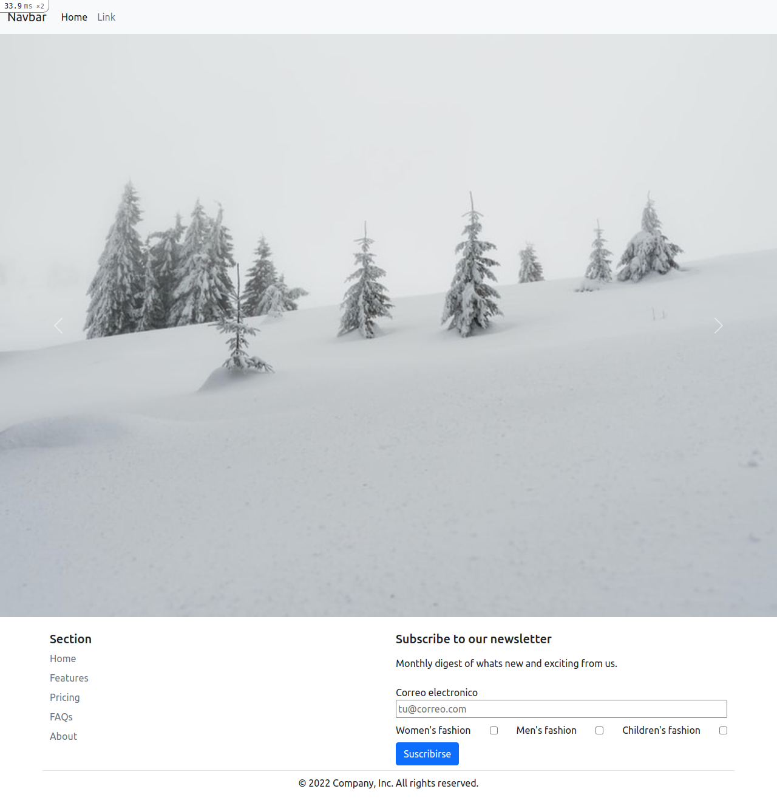
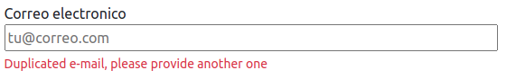
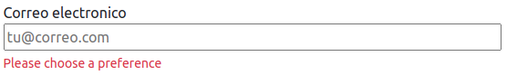
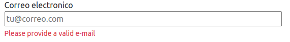
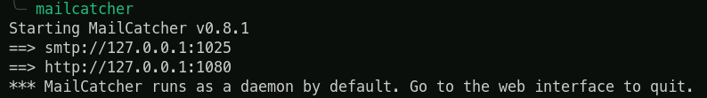
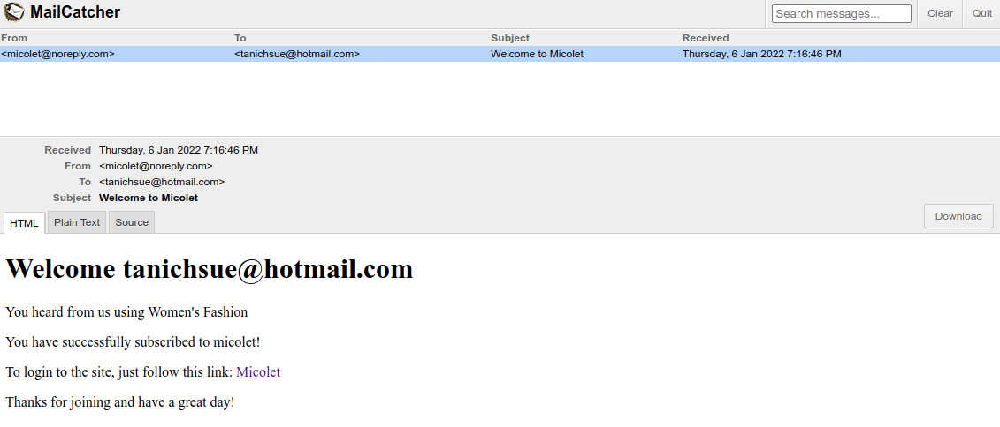
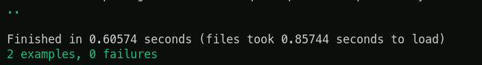
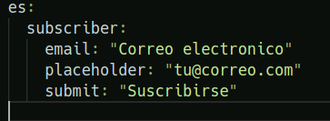

# Micolet coding challenge

# Objectives

- The email and user preferences must be stored in Database.
- The same email cannot be registered twice, an error message will be displayed to the user indicating that the email already exists.
- Make a simple validation of the user's input to guarantee that what they have entered complies with the valid format of an email.
- The user may select one or more preferences, but they must select at least one of them.
- Once the user has been registered successfully, an email will be sent confirming their subscription.

Extra Ball 1 (Optional):

- Even if the email has a valid format, that does not mean that it is an existing email. It could be that the domain does not exist, or it is not configured to receive mail. To prevent submitting this type of emails, we will only accept those that obtain a score greater than 0.7 when looking up in this API:

Extra Ball 2 (Optional):

- The landing page will be used in several countries, therefore it should be prepared to adapt it to different languages. This is what we know in software development as internationalization (i18n).

# Description of the Project

For the development of the project, the following tools were used:

- Rails v 2.7.2
- Bootstrap v 5.1

The purpose of the exercise is to build a simple landing page with a functional newsletter submission. Postgresql was used mainly to use the array functionality to save the subscriber's preference.

The project has a landing page with a functional newsletter subscription with a response if the email passes the verification.

The user can have 3 different kind of error warnings:

- Duplicated email

  

- Not choosing at least one preference

  

- Invalid email ( Extra ball 1)

  

### **Endpoints of API**

| Method | Endpoint    |        Functionality |
| ------ | ----------- | -------------------: |
| GET    | home        |          Lading Page |
| POST   | subscribers | Create subscriptions |

## How to start the project from your Local environment

- Open your terminal and cd where you want to store the project
- Run the following command - `git clone https://github.com/Wusinho/nicolet-coding-challenge`
- Cd into the created directory
- Run $ `bundle install`
- On terminal type $ `rails db:create && rails db:migrate`
- On terminal type $ `rails server`

## Checking the delivery system

- On terminal: $ `gem install mailcatcher`
- Type $ `mailcather`

  

- Open the browser and type : `http://127.0.0.1:1080` on search bar
- Open the landing page at `http://localhost:3000/`
- Create a subscription with a valid email

  

## Tests

## Extra Ball 2

- I18n was implemented to the subscription (`./config/locales/en.yml`)

## Author

👤 **Heber Lazo**

- Github: [@Wusinho](https://github.com/Wusinho)
- LinkedIn: [Heber Lazo](https://www.linkedin.com/in/heber-lazo-benza-523266133/)

## 🤝 Contributing

Contributions, issues, and feature requests are welcome!

## Show your support

Give a star if you :star: like this project!

## 📝 License

This project is [MIT](LICENSE) licensed.
